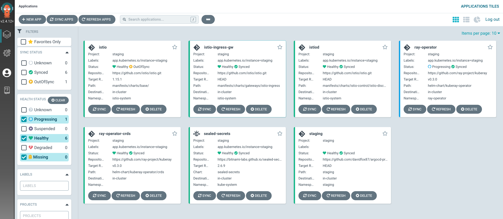
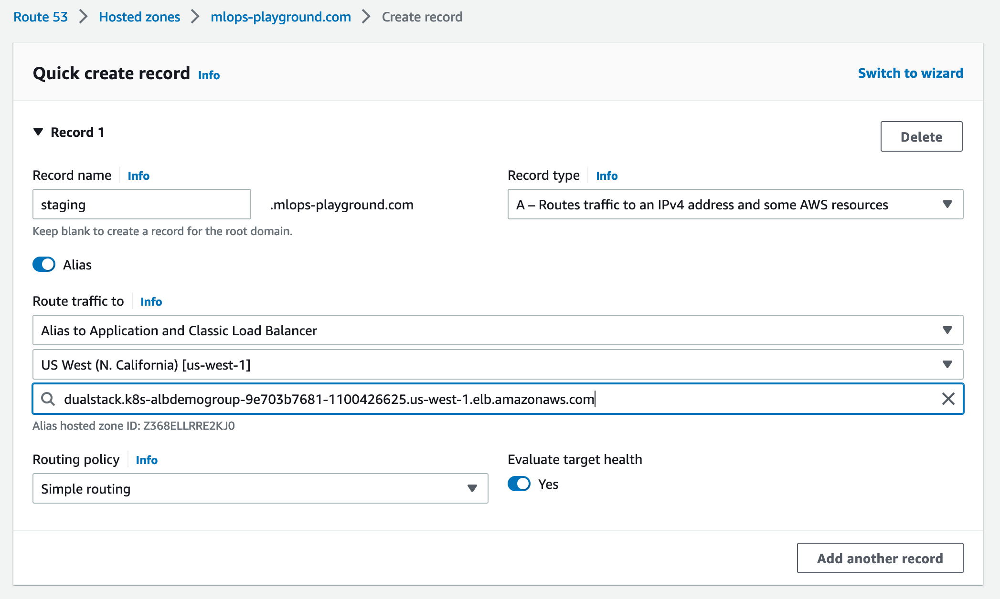

# Using ArgoCD to deploy Secure end-to-end traffic on Amazon EKS using TLS certificate in ACM, ALB, and Istio gateway and service mesh.

## Deploy to the AWS EKS using Terraform! 
Our AWS infrastructure will consist of the following:

- EKS Cluster: AWS managed Kubernetes cluster of master servers
- EKS Node Group
- Associated VPC, Internet Gateway, Security Groups, and Subnets: Operator managed networking resources for the EKS Cluster and worker node instances
- Associated IAM Roles and Policies: Operator managed access resources for EKS and worker node instances

To spin up our infra, do the following:
```
terraform init
terraform get
terraform apply
```


Verify the aws-load-balancer-controller is installed
```
kubectl get deployment -n kube-system aws-load-balancer-controller
```
## Our infrastructure in aws will look like this (substitute gRPC traffic with HTTPS traffic):


## End-to-end traffic encryption using a TLS certificate from ACM, ALB, and Istio in the Amazon EKS.
In the following steps, I implement end-to-end encryption using a TLS certificate in AWS Certificate Manager (ACM), Application Load Balancer (ALB), and Istio gateway and service mesh in an AWS EKS environment. Istio generates detailed telemetry for all service communications within a service mesh. This telemetry provides full observability of traffic in and out of the mesh and between services inside the mesh. Istio integrates extremely well with Prometheus and Grafana, which we will also install using ArgoCD.


## Installing Argo-cd 
[Getting started with ArgoCD](https://argo-cd.readthedocs.io/en/stable/getting_started/)
```
kubectl create namespace argocd
kubectl apply -n argocd -f https://raw.githubusercontent.com/argoproj/argo-cd/v2.4.12/manifests/install.yaml

kubectl port-forward svc/argocd-server -n argocd 31719:443

xdg-open https://localhost:31719
```

The API server can then be accessed using https://localhost:31719

```
kubectl get pods -n argocd -l app=argocd-server -o name | cut -d'/' -f 2
kubectl get secret argocd-initial-admin-secret -n argocd -o yaml
echo akRjVGZmNjhxbTdJWHB3OA== | base64 --decode
```
Take the decoded password and login to the ui

## clone the repo which has our ArgoCD manifests for the project and app
```
git clone git@github.com:davidfox87/argocd-production.git
```
Install projects and apps
```
kubectl apply -f projects.yaml
kubectl apply -f apps.yaml

```

## generate tls-secret using sealed secrets
Note the tls-secret needs to go in the istio-system namespace because the istio-ingressgateway needs to access it (didn't see that from the docs).
I put the gateway and tls-secret in the istio-system namespace and the istio virtual services go in their own namespaces. The virtual services will reference the gateway using svc.namespace.svc.cluster.local naming convention to reference services in other namespaces. This is done in the following way:

```
apiVersion: networking.istio.io/v1alpha3
kind: VirtualService
metadata:
  name: task-tracker-app-ui # name of the k8s service
spec:
  hosts:
  - staging.mlops-playground.com
  - task-tracker-app-ui
  gateways:
  - public-gateway.istio-system.svc.cluster.local
```

### Generate the tls-secret and then use sealed-secrets to encode it. 
If we use sealed secrets, we can then store everything in github (without getting fired) and then argocd can manage the deployment using manifests stored in github (which is our source of truth)
```
kubectl create secret generic tls-secret -n staging \
--from-file=key=certs/key.pem \
--from-file=cert=certs/cert.pem

kubectl get secret tls-secret -n staging -o yaml | kubeseal --controller-namespace kube-system \
                                                 --controller-name sealed-secrets \
                                                 --format yaml tls-secret.yaml \ 
                                                  > base/tls-secret.yaml
kubectl delete secret tls-secret -n staging


kubectl create secret generic tls-secret -n istio-system \
--from-file=key=certs/key.pem \
--from-file=cert=certs/cert.pem
```

## wait for everything to sync and be healthy in the argo-cd UI
The following screenshot shows the applications that argocd has deployed into our EKS cluster either from our own kustomize application manifests or third-party helm charts.


## configure healthcheck path for alb
To configure the alb.ingress.kubernetes.io/alb.ingress.kubernetes.io/healthcheck-path get a readinessProbe from the  Deployment, which creates pods with the istio-ingressgateway:
```
kubectl -n istio-system get deploy istio-ingressgateway -o yaml
...
readinessProbe:
failureThreshold: 30
httpGet:
path: /healthz/ready
...
```

Set annotations for the istio-ingressgateway Service: 
- in the healthchek-port set the nodePort from the status-port 
- in the healthcheck-path – a path from the readinessProbe:

Note that the nodeport for the status-port will change so you will have to edit it after the service has come up

It should look like this 
```
    alb.ingress.kubernetes.io/healthcheck-path: /healthz/ready
    alb.ingress.kubernetes.io/healthcheck-port: "30829"
```

Add these annotations to the existing istio-ingressgateway service manifest
```
kubectl -n istio-system edit svc istio-ingressgateway
```

## apply ingress object
Ingress object will spawn aws-load-balancer-controler, which has a backend that points to istio-ingressgateway
Important!!! The ingress object has to go into the istio-system namespace.

```
kubectl apply -f istio-gw-ingress/ingress.yaml -n istio-system
```

AWS ALB Ingress Controller will create a TargetGroup to be used with the ALB
The Gateway and VirtualService that will configure Envoy of the Istio Ingress Gateway to route traffic to the Service of the application

## Map the domain name that is associated with ACM certificate to the ALB just spawned


## Our true GitOps CI/CD platform


## installing MLflow server with ingress and s3 artifact store
[MLflow](https://mlflow.org/) is an open source platform to manage the ML lifecycle, including experimentation, reproducibility, deployment, and a central model registry. It offers the following features:
- it allows you to store models artifacts in a central repository
- record and query the results of machine learning modeling experiments: code, data, config, results
- package DS code to reproduce any run on any platform

In ```applications/mlflow```, we run the MLflow tracking server from a containerized service and deploy through a kubernetes deployment manifest. The DB metadata connection parameters and artifact store are mounted to the container as environment variables through secrets and configmaps.

## Clean up your workspace

Delete the application in argo-cd

Then destroy all infrastructure in AWS using
```
terraform destroy
```


